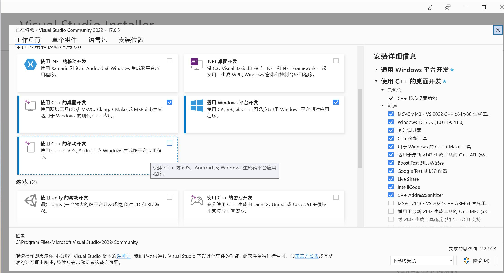
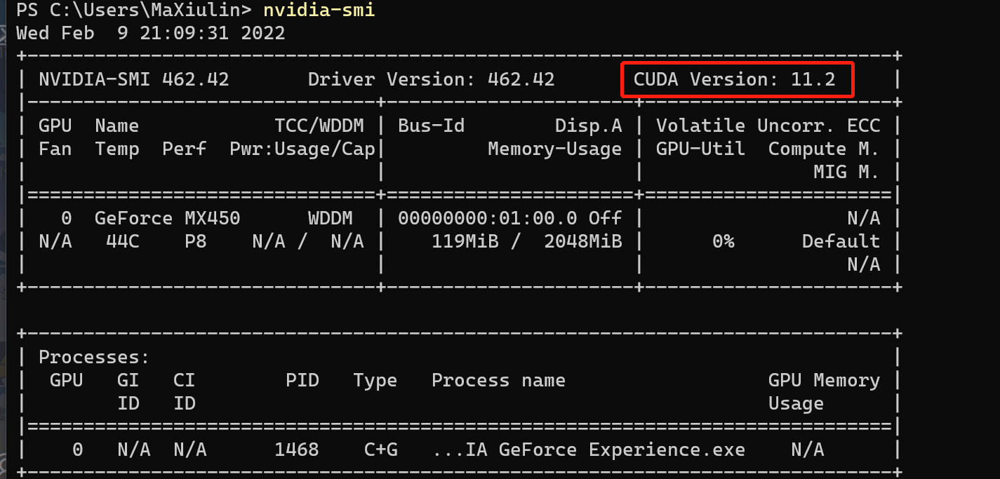
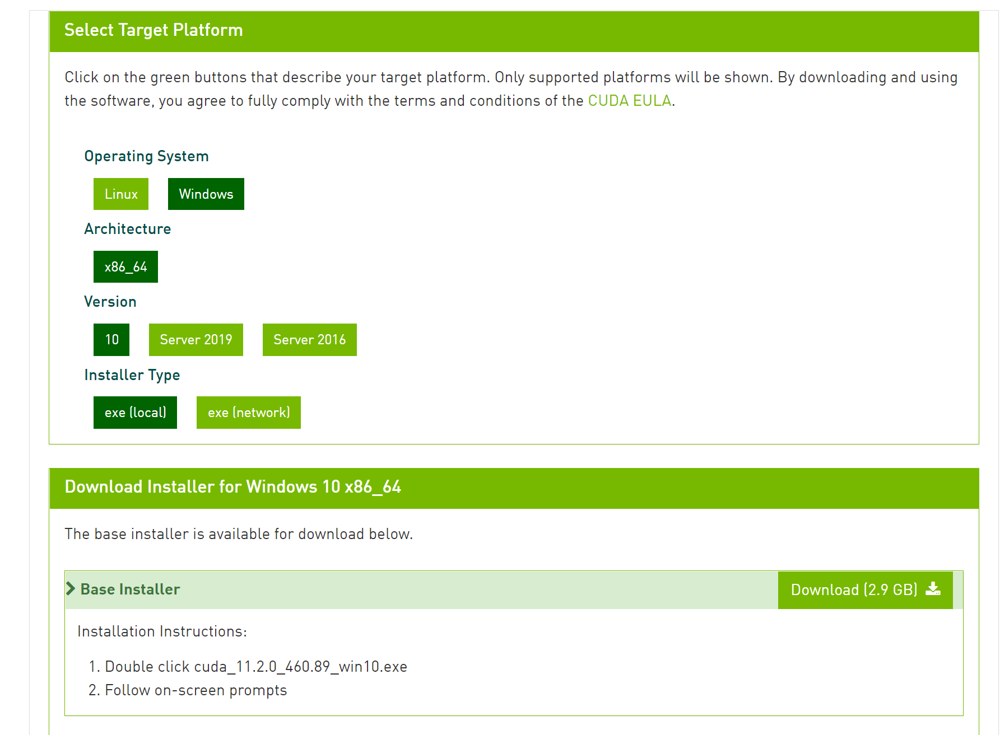
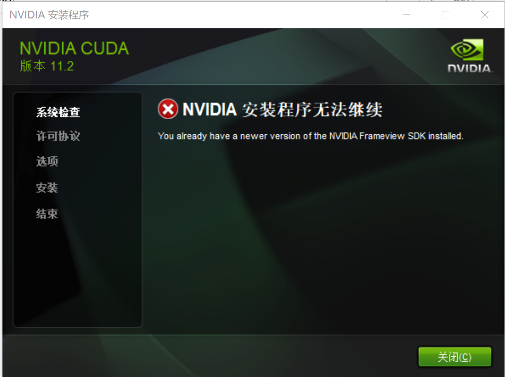
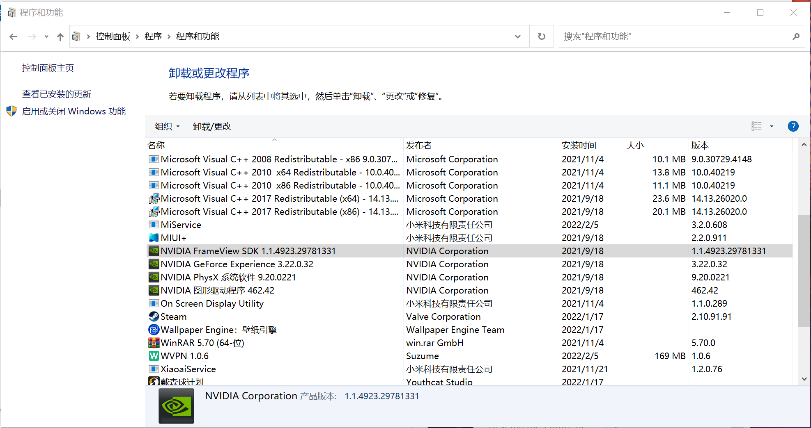
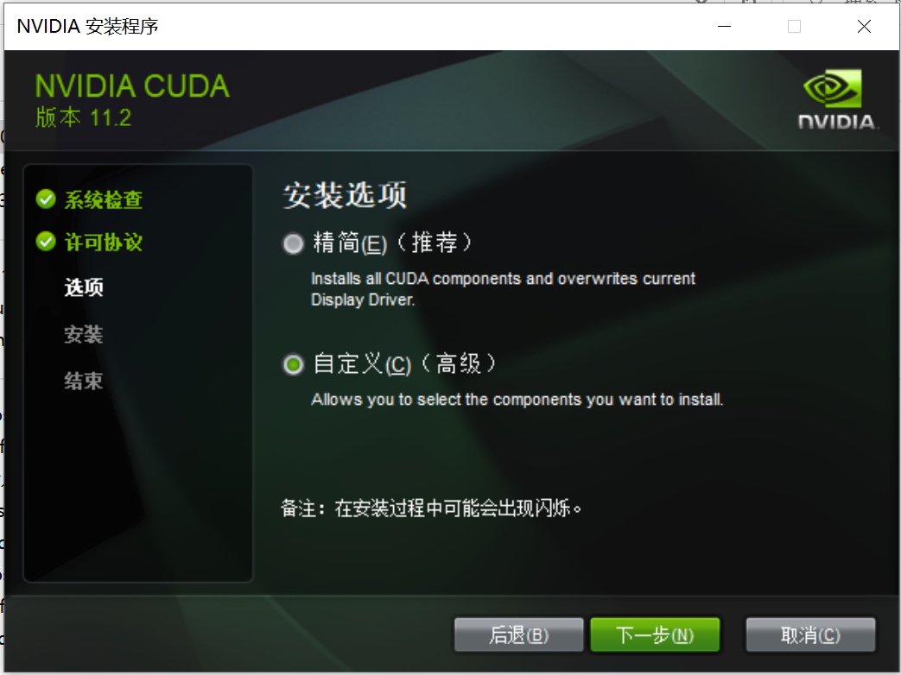
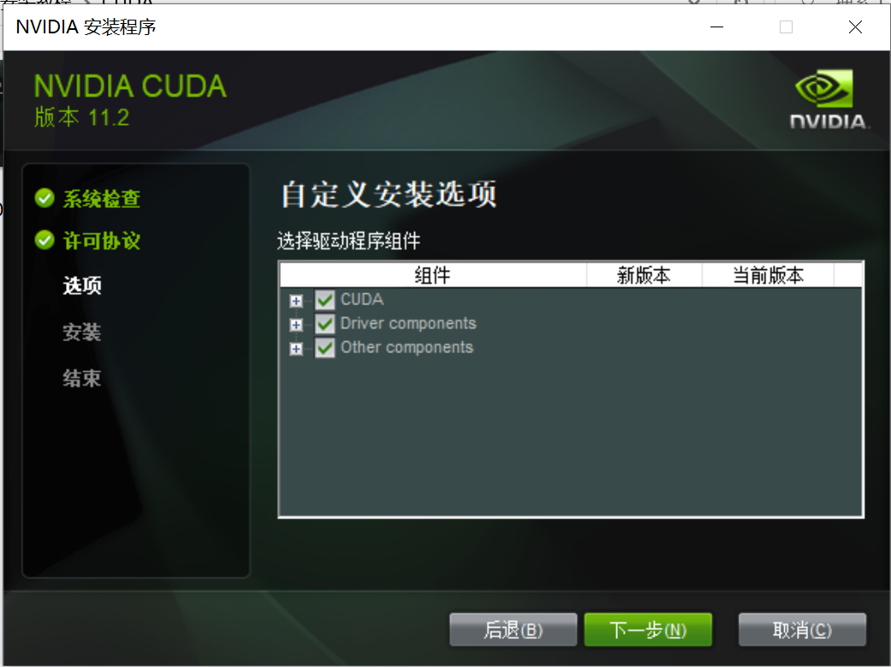
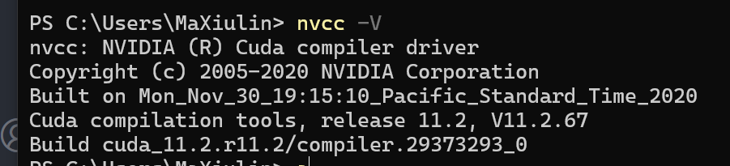

# Windows下CUDA环境配置教程😄
[](https://github.com/sunnyhaze/)  

## 从浅显的角度看什么是CUDA
CUDA（Compute Unified Device Architecture），是由显卡厂商NVIDIA（英伟达）推出的运算平台，**是一种通用并行计算架构**，也是一种编程模型。
### 简史
GPU（Graphic processing unit，图形处理器)，早期指显卡中的数据处理芯片，现在也指完整的显卡本身。显卡最早是专门用来处理计算机系统中的图形数据，以减轻CPU的负担，可以提高对于复杂图形的显示能力和显示速度。

后来随着显卡能力的逐渐提升，其对于**不带有太多逻辑分支的大量的数据的计算能力**已经超越了为**通用逻辑计算**设计的CPU，如此强大的芯片结构如果只用于计算图形数据太浪费了，因此NVIDIA推出了CUDA，让显卡在图像计算以外，可以在其他场合对于海量数据提供高效的计算。

### 特点
+ 因为是英伟达开发的，且受到底层指令集限制，所以支持CUDA的显卡只有英伟达自家的显卡。别的厂家搞了其他的所谓“通用并行计算”架构，但是因为在工业/学术界进场较晚，目前份额和流行程度远不如CUDA
+ 目前广泛用于深度学习领域，主流的`Pytorch`和`Tensorflow`均在底层实现了基于CUDA的GPU加速，为复杂的数值运算提供效率保障。
+ CUDA内部实现逻辑打通了GPU和CPU、内存和显存的调度和操作，有能力的开发者也可以自行设计优秀的算法满足自己的运算需求，相比深度学习的单纯使用，这个方向更加具有挑战性，目前在游戏开发、高性能计算平台的开发中有相当的用武之地。

## 安装
### 预先安装Visual Studio
+ 注意： **<font color=red>如果你安装CUDA是为了进行Windows中的CUDA C/C++程序开发，在安装CUDA之前要先安装Visual Studio</font>**
  
这是因为，在Windows下为了编译CUDA程序，需要使用Visual Studio的内置编译工具等等（Linux主要采用CMAKE的配置文件），但是需要**由CUDA安装程序向Visual Studio中添加相关的配置和依赖后**才能正常执行CUDA代码。所以要先安装Visual Studio再安装CUDA Toolkit。

> 需要注意，在本教程成文时，CUDA并无法支持VS2022的环境安装，目前最新只能支持到VS2019，所以开发者需要适当选择稍早的VS版本进行CUDA C/C++程序开发

如果你只是为了运行`Pytorch`或`tensorflow`程序，且再可以预见的未来并不会涉及底层CUDA开发，则无需考虑这一步，直接跳到下一段`检查固件`即可。

一般对于普通的大学生来说，下载社区版（community）足够使用了，链接如下：
[VS早期版本下载网站](https://visualstudio.microsoft.com/zh-hans/vs/older-downloads/)
[VS最新版下载网站](https://visualstudio.microsoft.com/zh-hans/downloads/)

安装时主要安装如下两个组件即可，（右侧的`通用Windows平台开发`应该是**非必要的**，理论上只安装左边就行，但作者没有尝试过）：


### 检查固件
因为CUDA的指令集和驱动基本都是由显卡本身决定的，所以要先查找自己的显卡支持的CUDA版本，只能安装自己电脑支持的CUDA版本。

在有英伟达显卡，且安装过显卡基本驱动的电脑的命令行中输入如下代码
```powershell
nvidia-smi
```
就可以查看自己显卡的基本情况，并从红框位置看到自己显卡支持的CUDA版本，笔者的破笔记本支持的是`11.2`版本：


然后可以前往英伟达官网寻找相应的`CUDA Toolkit`下载安装，链接如下：

[英伟达CUDA全部版本网站](https://developer.nvidia.cn/cuda-toolkit-archive)

按照网页提示选择对应版本下载即可，推荐选择`local`，此过程可以使用代理加速或者其他加速工具下载，如果选择`network`则下载一个较小的下载器，由下载器代为下载，有时反倒会更缓慢。



下载过后运行安装程序，可能会发生`You already have a newer version of the NVIDIA Frameview SDK installed`的错误，此时是与另一个驱动发生了冲突，



需要先把电脑已经存在的FrameView SDK 卸载掉，从控制面板-程序-卸载或者其他途径卸载均可。



然后即可正常启动安装程序进行安装。

在如下界面选择自定义，以保证安装完整组件：


选择后勾选所有选项：


随后就不断的勾选下一步直至完成即可！

### 测试安装是否成功
+ 打开命令行工具，输入以下代码以测试是否正确安装了CUDA环境，注意后面的`-V`要大写：
  ```
  nvcc -V
  ```

正常弹出如下信息即说明安装成功！

