# VSCode 下配置编译C++环境-Windows操作系统下
寻找一个可以写C/C++代码的软件，是计算机专业大一新生初入大学最先遇到的问题。常见的选择和优劣势有：
|软件名|优势|劣势|
|-|-|-|
|Dev-C++|非常轻量，且可以方便进行多文件编译运行|颜值不高，缺乏插件支持，不便于自定义|
|Visual Studio|一站式解决方案，超强的“大炮”，实际工业开发中也经常使用（不仅仅是C++，C#，CUDA等等）|全能的代价是整个软件体积非常巨大，而且对于“解决方案”的定义和规划比较复杂，对于**新人会比较难上手**|
|Visual Studio Code|具有插件系统，通过安装开发好的插件，可以快速拥有好看美观的代码编辑器，不仅可以运行C++，经过配置后可以运行很多其他程序|此程序本身**不具备运行代码的功能**，可以看做是一个超高级的记事本（txt）。实际的代码运行是由系统内的其他环境（编译器）支持，所以每运行一种代码，都需要安装对应的环境|
> Visual Studio听上去和Visual Studio Code非常像，但是二者主要是名字相近，且均由微软公司所有。其实二者的差别非常大，前者自身就是个完整的IDE（Integrated Development Environment，集成开发环境），而后者则是一个现代化的轻量级文本编辑器。

综上，我们认为对于新生来说，使用VS Code来编写、运行C++程序是比较美观，且难度较小的。本文接下来就教学如何配置好这个环境。

## 1 教程
### 1.1 安装VS Code
+ 前往官网下载安装即可
  + [VS Code官网链接](https://code.visualstudio.com/)
+ 然后需要注意的是，这个页面的一定要✅**全部勾选**，可以方便使用时快捷调出VSCode（图片中没有勾选，我会择机在重新安装时截屏一张**全部勾选**的图替换）
  
  

+ 其余的可以参考网络教程，或者就一路“下一步”到底就行
### 1.2 安装所需插件
VS Code的强大之处就在于丰富的插件，所有的插件安装都需要在VS Code左侧的选项卡中选择【拓展】后来进行。

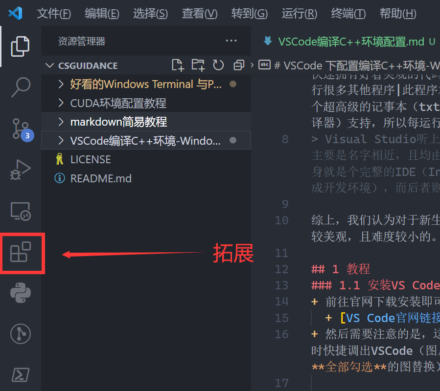

单击后，在拓展界面输入关键字**搜索**对应拓展并安装即可，一般来说官方的，下载量高的拓展，都是得到大家认可，可以一试的插件。

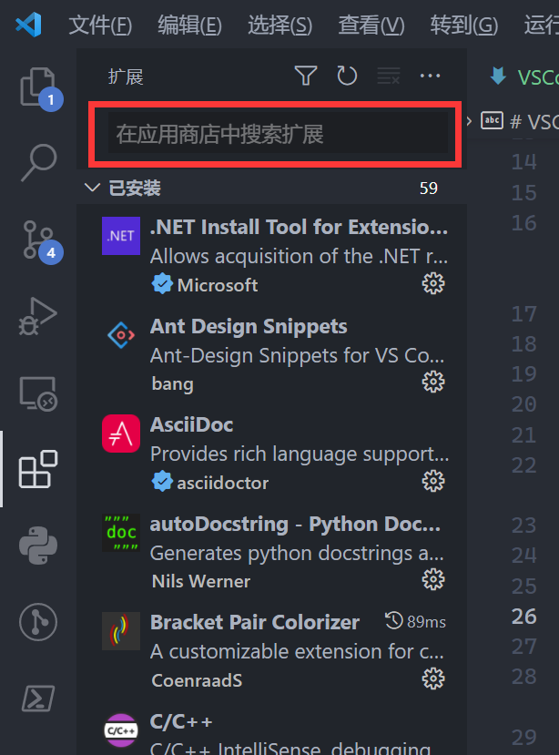

> 特别注意，开始你可能会被琳琅满目的插件整糊涂。请遵循一个原则：尽量在自己不知晓一个插件行为的时候不去安装它。 因为插件都是独立开发者开发的，他们难以顾及到和所有插件的交互都正确，插件和插件之间很可能起冲突，所以尽量保证整洁可以有效提升运行速度。

为了能让我们更好的使用VS Code来运行C/C++程序，我们需要依次安装如下插件：
#### 1.2.1 简体中文插件
- 检索：在搜索区输入`Chinese`即可
  
  

- 功能：安装后可以使整个VS Code 的按钮和功能变成中文。

#### 1.2.2 C/C++插件
- 检索：在搜索区输入`c`即可
 
  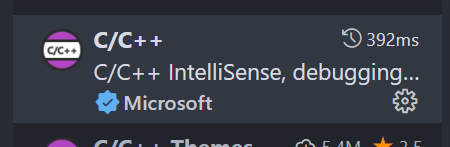

- 这个插件提供了对于C和C++的语言支持，包括不限于：
  - 代码补全
  - 代码高亮
  - 头文件之间的索引
  - 代码纠错
  
#### 1.2.3 Code Runner插件
- 检索：在搜索区输入`Code runner`即可，单击安装即可安装

  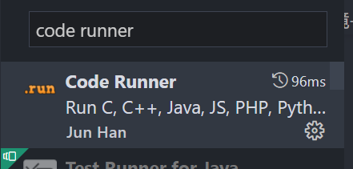

- 功能：因为VS Code本身并不能执行C++程序，需要调用`外部指令`来编译运行C++程序（下文会安装提供这个功能的`mingw`）。而最原始的手段是通过在命令行中输入编译命令（比如`g++ hello.cpp -o hello.exe`）来编译文件，可能对于初学者难以理解这个语句的含义和行为。简单`Code runner`能做的就是自动向你的命令行中输入对应语言的编译指令，来帮你“一键”运行你的代码。
- **注意事项**：安装好后需要在左上角的【文件】→【首选项】→【设置】中，利用搜索找到`run in terminal`这个选项，并勾选上才能正常运行这个功能。

  

-----

插件全部安装完后，建议重新启动VSCODE保证每个新安装的插件都正确加载。这样你的`VS Code`就配置好了，你可以编写一个`helloword`程序观察代码已经高亮了，并通过右上角的`小三角`来尝试运行代码。

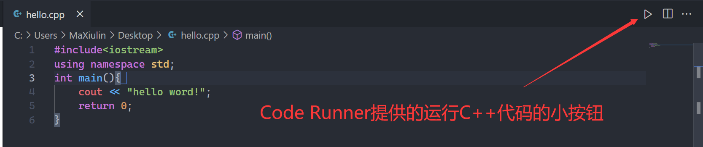

但是此时应该会报错，因为我们并没有安装能实际运行C++程序的程序。

> 可能你发现你的界面颜色和我不一样，如果你喜欢暗色风格，我非常推荐你搜索插件`one dark pro`，安装后即可加载我这个配色。

### 1.3 安装MinGW
MinGW全称是：Minimalist GNU for Windows 直译是Windows下最小GNU工具集。GNU是一个计划，详情可以自己去检索，这里你只需要知道这个工具集提供了`gcc`和`g++`两个工具来帮助我们分别编译`C`和`C++`代码文件即可。至于`for windows`是因为这两个工具本身是在`Linux`平台上开发的，这款`GNU`工具集是后来迁移到Windows平台上的。

综上，MinGW可以帮我们编译C和C++程序。实际使用中，VSCode帮我们撰写代码，而后交给MinGW来运行并得到结果。

#### 1.3.1 下载MinGW
推荐下载网址：[sourceForge-MinGW-w64](https://sourceforge.net/projects/mingw-w64/files/)

点进去后，向下翻，找到这一项后单击，跳转页面后等待五秒自动下载：

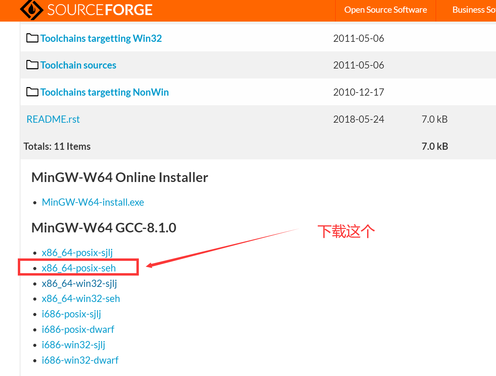

此文件国内传输较慢，开代理可以加速，或者找已经下载过的同学学长索要即可。

#### 1.3.2 添加MinGW到环境变量
- 首先建议在D盘或者C盘根目录新建一个名为`MinGW`的文件夹
- 将刚才下载的压缩包`x86_64-8.1.0-release-posix-seh-rt_v6-rev0.7z`解压到这个文件夹下，如果你无法解压`7z`文件，请先百度检索如何解压`7z`文件解决问题。
- 解压后，前往解压出来的文件夹的`mingw64`路径，并在其下进入`bin`路径。
  
  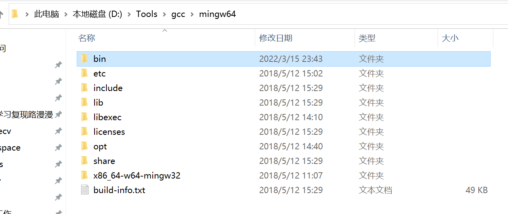

  而后在bin路径中，单击导航栏，并**复制**这个完整路径：

  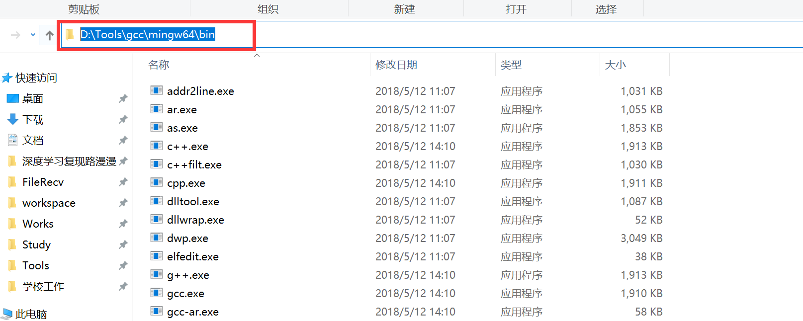

- 然后找到`此电脑`（一般在桌面，或者去开始菜单搜索）。右击`此电脑`打开右键菜单并单击【属性】
  
  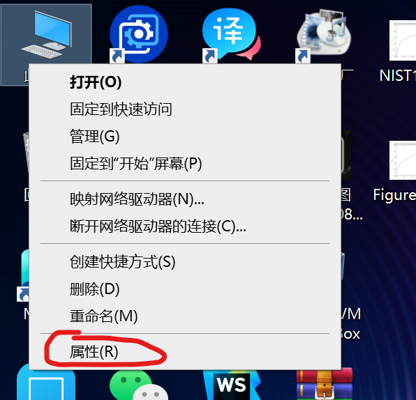

  而后向下翻，找到【高级系统设置】，单击它

  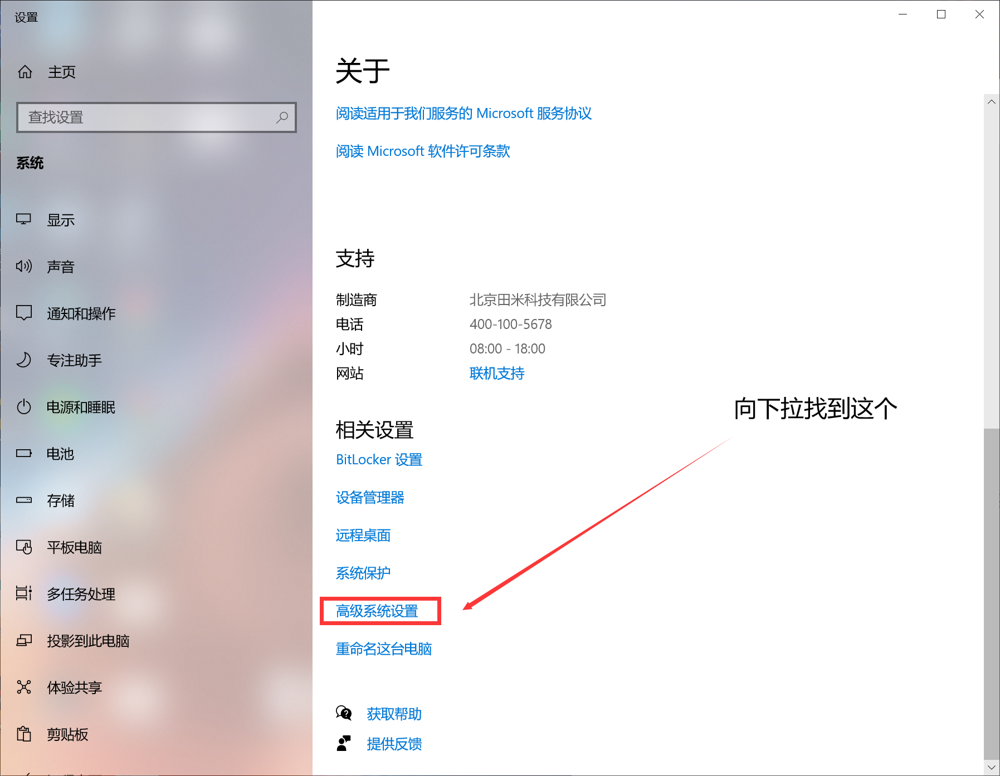

  在窗口中找到【环境变量】，单击它

  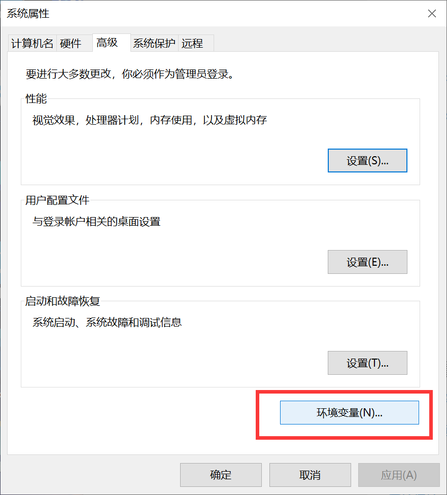

  在下方的【系统变量】中找到`Path`并选中，然后选择下方的编辑：

  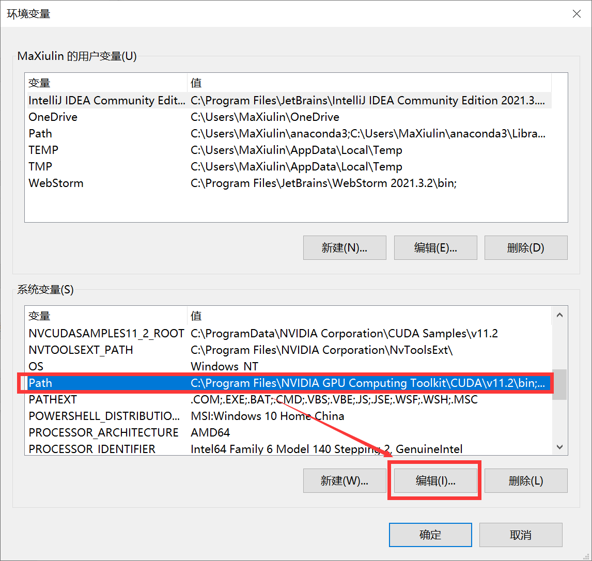

  在此时弹出的界面选择【新建】，会在最后一行让你编辑，此时**粘贴**上一节拷贝的带有`.....\bin`结尾的路径，并单击确定即可.之后不断单击确定以退出之前打开的所有窗口。

  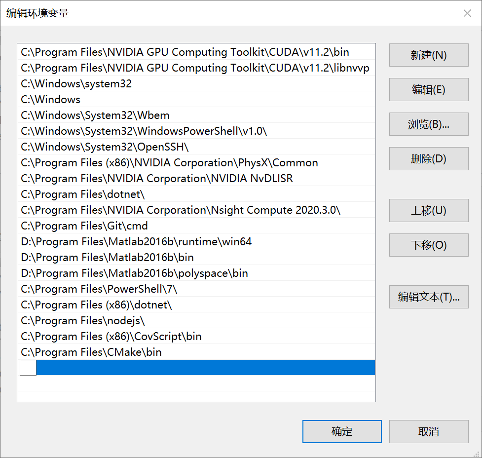

  -------
  这样我们就完成了MinGW的手动配置，此时我们可以尝试在`cmd`或者`powershell`中运行`gcc`指令。如果出现下图，则说明安装成功！

  

  ## 2 测试
  此时我们需要关闭`VS Code`的所有窗口，以使其重新加载环境变量。

  而后我们打开VS Code，并用其打开刚才的`hello world`程序，此时再单击右上角的小三角运行程序，我们就可以观察到正常运行的程序了！此时在最后一行正常输出了`hello world`。说明安装成功！！！

  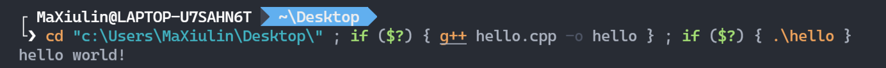

  其中你可以注意到中间那一行，实际上是执行了一系列语句来帮忙运行这个程序，首先是切换工作路径到这个文件存储的地方，然后利用`g++`指令编译这个文件为`hello`，最后运行`.\hello`文件以输出结果。

## 3 特别事项
  你可能会注意到上图中，我的命令行**比较好看**，这就需要你参考接下来的[一篇文章](../好看的Windows%20Terminal%20与Powershell%207/WindowsTerminal配置教程.md)来辅助VSCODE进行美观的命令行工具配置了。如果你完成了上述配置，则也能像我一样得到一个好看的命令行工具。