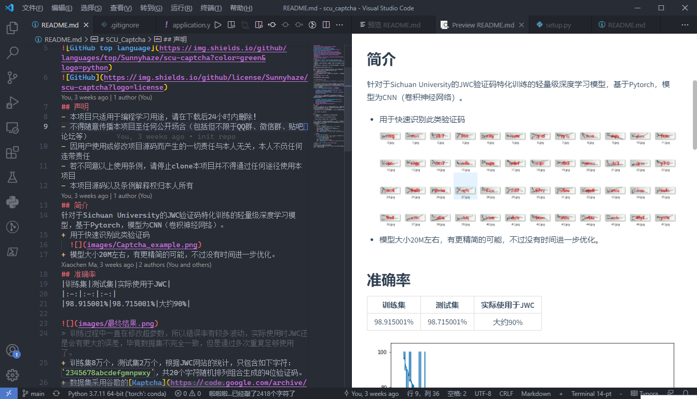
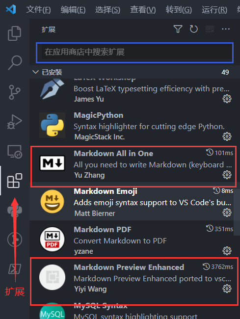
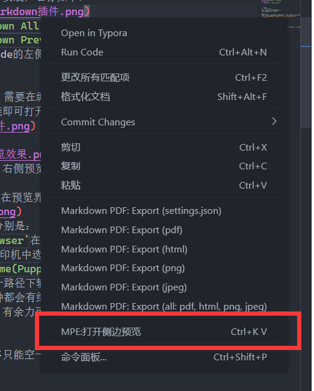
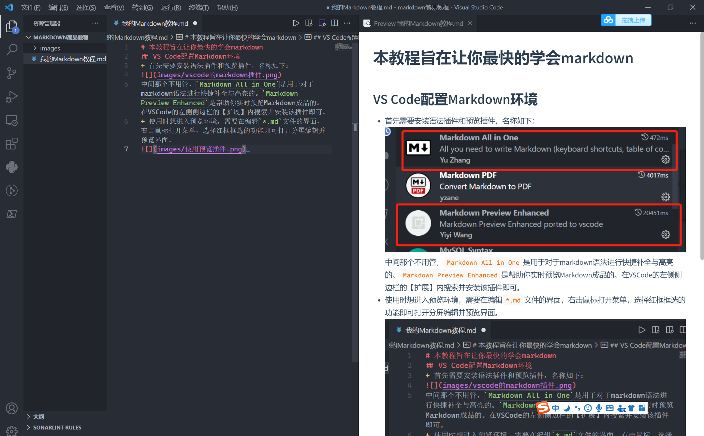
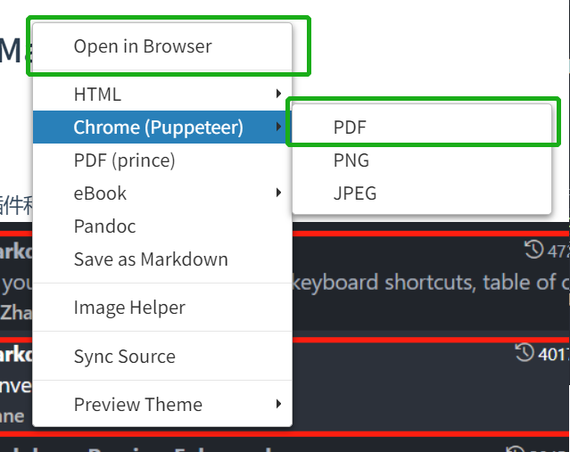
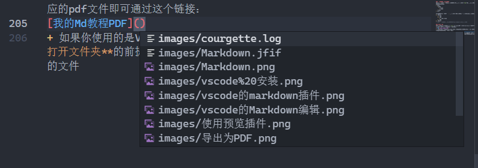
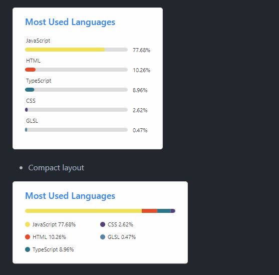

# 本教程旨在让你最快的学会markdown😄
[](https://github.com/sunnyhaze/)  
>本文件夹下提供了`我的Markdown教程.md`和`我的Markdown教程.pdf`两个文件。后者完全由前者生成，可以通过观察`.md`文件理解如何实现的`.pdf`中的排版
## 什么是Markdown
Markdown是一种轻量级「标记语言」创始人为John Gruber，目前广为程序员群体所使用，现在也逐渐成为国际杂志编辑以及许多写作者都广泛使用的标记语言。

**简而言之，Markdown就是通过少量的符号的标记对于纯文本进行排版，实现“易于阅读、易于撰写”的纯文字形式**，本教程就是基于Markdown撰写的。Markdown文件的后缀为`*.md`。

目前像**知乎、博客园、CSDN、Github**等等平台都支持或部分支持了Markdown语法，在这之前如果想在网页中排版需要创作者有良好的HTML基础，而现在则完全不需要了，只要你稍加学习，就可以全身心投入优质内容的创作了。
### 它有什么特点
+ 非常轻量
+ 通过键入各种符号进行标记排版，与word的区别在于全程手不用离开键盘就能实现各种格式，比如多级标题、**加粗**、*斜体*、多级列表等等，**非常高效！！！** 可以让作者更关注于内容本身进行高效创作。
+ 支持内嵌图片、图表、数学公式（$E=mc^2$），带高亮的代码块等等。
  + 因为这个特性，所以现在Markdown广泛用于程序文档的编写，或者很常见的`README.md`文件（用于向使用者说明一些事项）的书写
+ 可能看上去非常复杂，但是学习成本很低，只需要1-2h就能完全上手，用来做笔记或者简单记录一些事项都是极为好用的。
+ **进阶：** 实际上Markdown完全支持内嵌HTML语言，如果当你发现日常有单纯通过Markdown语法实现不了的效果，可以通过HTML语言的所有方式实现。这样来说其实Markdown能实现的效果是非常非常多的。比如输出一个红色字体是原生Markdown语法做不到的： <font color=red>我是HTML红色字体。</font>
  + HTML可以参见其他教程，本文不多赘述 
### 常见的Markdown编辑器
Markdown本身是一种规范、一种语法解析格式，不是一个软件。于是目前存在很多很多不同公司或爱好者开发的Markdown编辑器。需要区分开。

这里介绍两个用的很多的编辑器，本文着重介绍后一个，可以都体验一下。
#### Typora
+ [官网链接](https://www.typora.net/)
+ Typora是一个完整的软件，提供了对于Markdown预览，编辑，导出为PDF等等的支持。以及对于文件夹下一些Markdown文件的管理。
+ 早年间一个比较好用的编辑器，风格简约美观，可以实现所见即所得。
+ 现在**正版收费了！！！** 不过可以找往期不收费的开发版使用。
#### 基于Visual Studio Code插件的编辑器
+ `Visual Studio Code`是微软开发的**轻量级代码编辑器**，它不是一个完整的IDE，本身只具有代码编辑与补全的功能，不具备编译运行功能。
+ 但是可以通过安装插件或配置依赖来支持几乎所有主流编程语言代码的书写、补全与运行。
+ 因为其高度定制化、轻量级、美观好看的特点，在程序员业内广受好评，本文中主要教学如何利用`VS Code`快捷、方便、美观地的编辑`Markdown`文本。设置好了可以实现左侧编辑，右侧预览的方式，是我比较喜欢的编辑方式。

## VS Code配置Markdown环境

### 安装VS Code
+ 前往官网下载安装即可
  + [VS Code官网链接](https://code.visualstudio.com/)
+ 然后需要注意的是，这个页面的✅尽量全部勾选，可以方便使用时快捷调出VSCode
  
+ 其余的可以参考网络教程，或者就一路“下一步”到底就行。
### 安装Markdown依赖
+ 首先需要安装语法插件和预览插件，在左侧找扩展（4个方块）点进去后在蓝框地方搜索如下两个插件并安装，名称如下：

+ `Markdown All in One`是用于对于markdown语法进行快捷补全与高亮的。
+ `Markdown Preview Enhanced`是帮助你实时预览Markdown成品的。在VSCode的左侧侧边栏的【扩展】内搜索并安装该插件即可。
> 其余的暂时不用管，VS Code可以安装非常大量的插件，每个都有自己的功能，但是安装的越多，越有可能起冲突，也会带来VS Code启动慢的问题，建议是搞不明白原理的插件尽量就先不要安装 
+ 这样你就完成了所有需要的软件安装。
### 使用
+ 使用时想进入预览环境，需要在编辑`*.md`文件的界面，右击鼠标打开右键菜单，选择红框框选的功能即可打开分屏编辑并预览界面。

预览效果如下：

这样就可以实现左侧编写，右侧预览了。
### 导出PDF
+ 如果想要导出PDF，可以在预览界面右击打开右键菜单:

  此处有两种操作方式，分别是：
  1. 选择`Open in Browser`在浏览器中打开本文档，然后在浏览器中右击并选择【打印】,并在打印机中选择【输出为PDF】即可
  2. 第二种是选择`Chrome(Puppeteer) -> PDF`，在安装了Chrome的条件下可以正常运行并在同一路径下输出PDF文件
+ 其他的选项也可以，每种都会有细微的格式、颜色等等的差别，但是需要预先安装对应的软件才能使用，有余力可以体验一下。 
## 使用简要教程
<font color=red><b>从此处往后此建议就不要再看本教程的PDF版本了</b></font>，可以在VS Code中打开`*.md`文件，左右对照着**代码**和**结果**观看。

### 基本语法
#### 段内空格和空行
段内的多个空格                只能空一格，但是可以通过`&nbsp;`来空格，或者切换输入法为全角空格来输入多&nbsp;&nbsp;&nbsp;&nbsp;&nbsp;&nbsp;&nbsp;个　　　　　空　　　　格

对于两个自然段之间，最多只能空一行，无论你打多少个回车
   


也只是挨着的两个自然段。

#### 加粗 和 斜体
有的时候需要**加粗**，可以通过两对`*`来实现，VScode中也可以通过先选中文字，再按`Ctrl+B`来快速加粗。

有时候需要*斜体*，使用一对`*`即可

***又要加粗又要倾斜*** 的话。使用三对`*`即可。

#### 删除线
需要表示~~不想要的内容~~，可以通过两对波浪线`~~`实现。
>Tips:有的时候会发生不渲染的情况，可以考虑在控制符号前后加空格来尝试解决

#### 引用
有时候需要引用一些名人的句子，使用`>`：
> 床前明月光 疑是地上霜 ——李白
> >可以嵌套引用的哦，不过没啥用。
> > >balabal

#### 分割线
有时候需要一条分割线，使用`***`即可
***
以下方法也能创建分割线
`* * *`
* * *
`*****`
*****
`- - -`
- - -
`---------`
----------
### 表格
表格利用`|`符号表示纵向边界，表头和表内容用一行`-`隔开。一个最简单的样例如下：
```
|姓名|学号|
|-|-|
|小明|26|
```
对应：
|姓名|学号|
|-|-|
|小明|26|
*****
在表头和表内容中间的行可以通过`:`来控制内容的对齐方式
```
|左对齐|右对齐|居中|
|:-|-:|:-:|
|a|b|c|
```
对应：
|左对齐|右对齐|居中|
|:-|-:|:-:|
|a|b|c|
### 代码块
可能你已经见到了，对于一些需要**等宽输入**的东西，比如一小段代码，或者代码中的变量名，可以用一对小撇` `` `，并在其中添加内容来输入（一般这个键在ESC下面）。这种方式是在文本段内的”段内代码“。比如Python中有`print("hello world)`可以用于输出。

另外你还可以在段外使用一对` ``` `构建一大段"段间代码“，并且支持在前一个三撇右侧标注语言类型，如果解释器支持，则可以按照语法对该语言进行高亮：
```cpp
#include <iostream> // C++的例子
int main(){
    std::cout << "hello world";
}
```

```Python
# 一段Python代码
name = input("请输入你的名字：")
print("你的名字是:", name)
```
你可能会疑惑，那我怎么知道什么语言能支持，且需要在代码段开始声明对应的语言呢？这里提供一个常见参考表格(仅包括大学中常见的语言）:
|编程语言|Markdown声明高亮|
|:-:|:-:|
|C|c|
|C++|cpp|
|C#|C#,c-sharp,csharp|
|Shell|bash,shell|
|CSS|css|
|Java|java|
|JavaFX|jfx,javafx|
|JavaScript|js,jscript,javascript|
|PHP|php|
|text|text,plain|
|Python|py,python|
|Ruby|ruby, rails, ror, rb|
|SQL|sql|
|Visual Basic|vb, vbnet|
|XML|xml, xhtml, xslt, html|
|R|r,s,splus|
|Matlab| matlab|
|GO|go|
### 公式
公式也是Markdown中一个很重要的技巧，这个公式主要是基于$\LaTeX$语法的，可以很方便的书写复杂的数学公式，是一个一定要学习的技巧和工具。

和代码块一样，公式也分为行内公式和独行公式，分别用一对`$`或一对`$$`实现，行内公式的例子是：$E=mc^2$
独行公式的例子是：
$$
J=\frac{1}{2}\sum^{N_L}_{j=1}(a^l_j-y^l_j)^2
$$
这个是深度学习中欧氏距离的定义式，可能你会纳闷这到底是怎么书写的，这部分知识本教程不过多讲解，学有余力可以多多钻研。在百度等平台搜索“Markdown 公式”会有很多教程。
> 个人建议是这东西不用一次性全学会，各种转义码背下来也会忘，需要使用的时候随用随查即可。
### 标题
+ 相信你已经在前文见到过了
+ 井号`#`可以用于粗体的大字标题。井号越多标题越小，最多应该只能支持到6级标题，**注意！星号与标题名之间有一个空格才是正确写法。**
```
# 一级标题
## 二级标题
### 三级标题
#### 四级标题
##### 五级标题
###### 六级标题
```
对应：
# 一级标题
## 二级标题
### 三级标题
#### 四级标题
##### 五级标题
###### 六级标题

### 多级列表和有序列表
可以用`+`或者`-`来构建多级列表，并使用空格或者`Tab`键进行缩进来控制多级列表的层级。
+ aaaa
  + bbbb
    + cccccc
      + dddd
  + eeee
+ ffff

有序列表则通过数字加`.`和空格来实现，同样通过空格来确认缩进层级：
1. 2022年
   1. 1月
   2. 2月
      1. 1日是春节
   3. 3月
2. 2023年
> Tips: 多级列表和有序列表可以混用的哦，保证缩进即可

### 文内超链接
文内链接的通用书写方式是`[]()`其中方括号中是会显示在结果中的文字，而小括号中的则是链接到的目标。比如一个网页链接：
```
[百度](www.baidu.com)
```
即可产生：[百度](www.baidu.com)
+ 注意：这个链接可以以“相对路径”链接到文件，比如我想打开目前文件夹下对应的pdf文件即可通过这个链接：
```
[我的Md教程PDF](我的Markdown教程.pdf)
``` 
即可产生：[我的Md教程PDF](我的Markdown教程.pdf)
+ 如果你使用的是VS Code，那么在你输入了小括号后，在你的VS Code是 **打开文件夹**的前提下，编辑器会给你弹出补全选项，可以很快捷地通过按`tab`来快速补全要链接的文件：
 

还有一种链接与具体网址分开的写法：
`[哔哩哔哩][1]`
然后在下文随便什么地方写，且此段不会显示在结果中：
`[1]:https://bilibili.com`
同样可实现这样的连接，一般用于链接非常冗长繁杂的地方：
[哔哩哔哩][1]

### 转义字符
你可能会纳闷，如果我就想在文中输入一些控制字符怎么办？这时就可以利用`\`来进行转义，只要在每一个需要输入的控制符号前面输入`\`，编辑器就会忽略掉该字符作为控制字符的语义，而只渲染其本身。比如\#、\*\*哈哈\*\*。 如果想输出斜杠本身，则键入两个斜杠`\\`即可：\\
### 插入图片
插入图片的基本语法上文已经见过很多次了，就是在超链接的前方加一个`!`即可，然后将链接的对象设置为图片的“**相对地址**”，一般这时方括号的信息无意义（不会显示）比如上文的：
```
 
```
就可以在对应位置添加一张图片，默认放大到图片原有大小，如果图片过大则只**等比例缩放至宽度占满当前屏幕**。

## 进阶技巧
+ 这一部分主要是适用于构建一个美观的Github仓库的`README.md`或者其他说明文档时使用的
+ 好看的规范的文档，是对于代码理解的体现，以及展现技术力（装B）的途径。
### 多语言切换
常见的操作方式是创建多个Markdown文件并命名为比如`README.md`和`README-ZH.md`，前者书写英文文档，后者书写中文文档，然后在各自的头部分别添加一行
```
[简体中文](README-ZH.md)
```
与
```
[English](README.md)
```
这个还是比较常见的，很多仓库都是国际好评的仓库，自然会有人提供多国语言的文档以供阅读，以这种方式就可以良好的构建多语言的参考。

> TIPS：相对路径一定是以整个仓库的根目录作为相对路径起点
### 好看的小按钮
有很多大佬开发并提供了一些**超级好看！！！** 的图片生成接口，比如本文最开头就使用了一些这个按钮。
#### Sheilds小图标
该网站提供了许许多多生成“小盾牌”的接口，其使用方式为通过从**特定格式组织好的网址链接**拉取图片，即可由服务器生成一个图片并传输给你显示，比如生成一个我的邮箱的图标：


同时也可以通过“嵌套”超链接和图片的方式，实现一个可以单击跳转的小图标
，这是一个跳转到我Github主页的图标：

[](https://github.com/sunnyhaze/) 

这种图标还可以实现各种与Github数据，或者社交媒体数据的动态互动，比如实时拉取一些指定仓库的特征信息并实时显示更新在这些小按钮上。可以参考我的[一个仓库的`README.md`](https://github.com/SunnyHaze/SCU-Captcha/blob/main/README.md)的使用方式（在Github中单击Raw）可以看源代码，英语好的也可以前往[Shields官网](https://shields.io)学习查看各种API的使用方式。
#### Github Readme Stats
+ [Github Readme Stats官网](https://github.com/anuraghazra/github-readme-stats)
+ 这个工具是一个印度的大哥开发的，可以很美观的提供个人`README.md`的数据统计
 
+ 同时也有代码构成的分析统计

+ 上述显示工具的具体使用方式可以参见官网，也可以参见[我的主页](https://github.com/SunnyHaze/Sunnyhaze)来确定最美观的构建方式。
+ 此外还提供了一个针对仓库的快捷连接的接口，配置得当挺好看的，可以用于仓库引用的书写：
    [](https://github.com/SunnyHaze/scu-captcha)


[1]:https://bilibili.com 