# Windows Terminal + Powershell 7配置教程😄
[](https://github.com/sunnyhaze/)  

> 本质上此教程就是给你提供一个【功能完善】【可自定义外观】的命令行工具，且可以与VS Code结合使用
- 是不是觉得Windows自带的命令行工具（CMD和powershell）又丑又难用？
- 使用微软最新开发的终端Windows Terminal，结合强大的`Powershell 7`来构建好看又美观的命令行工具吧
- 有一句话说的好，**好看就是第一生产力！**
- 笔者自用配置完成的Windows Terminal + Powershell

  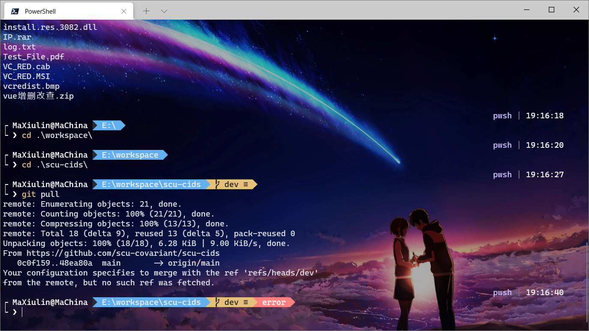 

- 在Vscode中使用的Powershell 7

  

> 本文全文配置完成时间较长，请选用整块的时间配置
## 知识扫盲
- 命令行是最早与计算机操作系统交互的方式，用户在**黑底白字**的界面上不断的输入指令，再由计算机返回结果。

- 即便是在图形化操作系统的今天，鼠标能实现的全部功能，理论上都可以通过命令行实现；而一些更加底层的功能，甚至只能通过命令行实现，所以学习命令行是必要的。
  - 尤其是对于一些没有GUI（Graphical User Interface，图形化用户界面）的软件，就只能使用命令行与其进行交互。
    - 比如C/C++在Windows中的编译器mingw
        >你可能会想到Dev-c++，那个也是封装了mingw才实现的图形编译，可以进行百度
    - 比如Python的解释器
    - 诸如程序员常用的`Git`也是最经常使用命令行进行交互的。
  - 没有图形界面会带来一个好处，操作系统可以把本来用于计算图像的算力转为用于计算，提高了系统的运行效率。
- 在Windows下，常见的可以对Windows操作系统进行命令行操作的就是CMD和Powershell两个，都是由微软提供的。
  - **CMD（Command Prompt，命令提示符）**，就是你【Win + R】调出运行菜单，然后输入`cmd`确定后调出来的窗口，较为简单，且支持的指令较少，语法大多来自最早的[DOS操作系统](https://baike.baidu.com/item/DOS/32025?fr=aladdin)。

    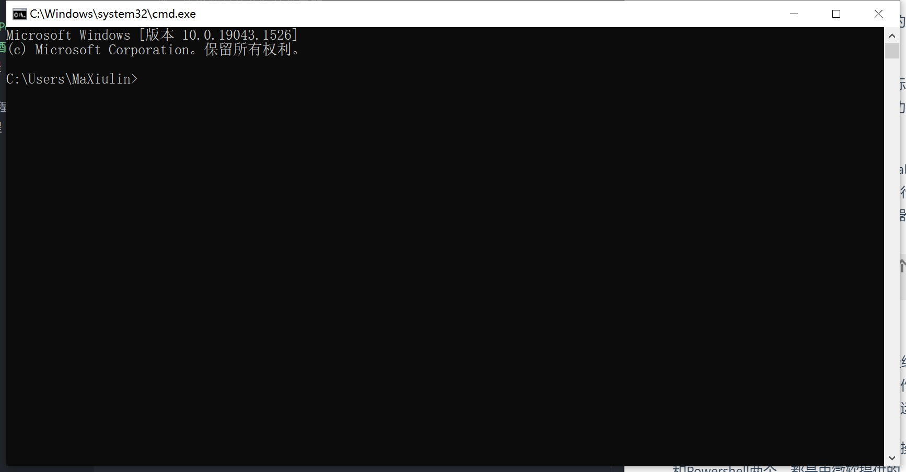

  - **Powershell**，微软随着时代的发展提供的“命令行外壳程序”和“脚本环境”，可以使用.NET Framework的功能，我们这里不深入介绍。
    - 浅显的理解就是它提供了一些CMD中没有实现的指令，借鉴了一部分`Linux`操作系统中的指令，使得操作和用户交互更加愉快。
    - 可以在【Win + R】的运行界面输入`Powershell`运行，也可以右击任务栏左侧的【开始菜单】以启动Powershell。
    - 目前Windows 7中内置了Powershell 2.0，Windows 8 中内置了 Powershell 3.0，Windows 10中内置了Powershell 5.1
    - 最新的Powershell大版本已经来到7，目前已经在Github开源，供广大开发正贡献自己的一份力量，丰富其功能。本文主要教学如何安装并使用Powershell 7，以下是官方的Github仓库链接： 
 
        [](https://github.com/PowerShell/PowerShell)

## 安装与配置
### 安装Powershell 7
可以前往Powershell 7的Github仓库，在Release中找到最新版本，请尽量选择**绿色标签的Latest版本**：[Release的链接](https://github.com/PowerShell/PowerShell/releases)

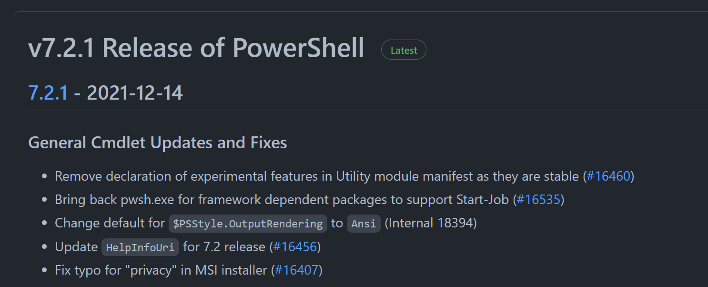

在该标签下寻找到适合您电脑的版本，这里提供红框里面版本的[下载链接](https://github.com/PowerShell/PowerShell/releases/download/v7.2.1/PowerShell-7.2.1-win-x64.msi)：

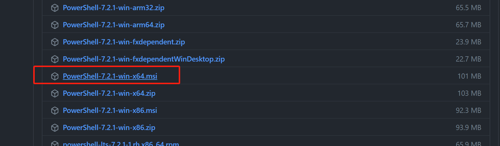

**<font color=red size=5>注意：这一步一定要安装在默认C盘路径，安装在其他路径会导致Terminal找不到Powershell 7 </font>**

按部就班安装就好，这里推荐在中间过程时勾选如下4个：

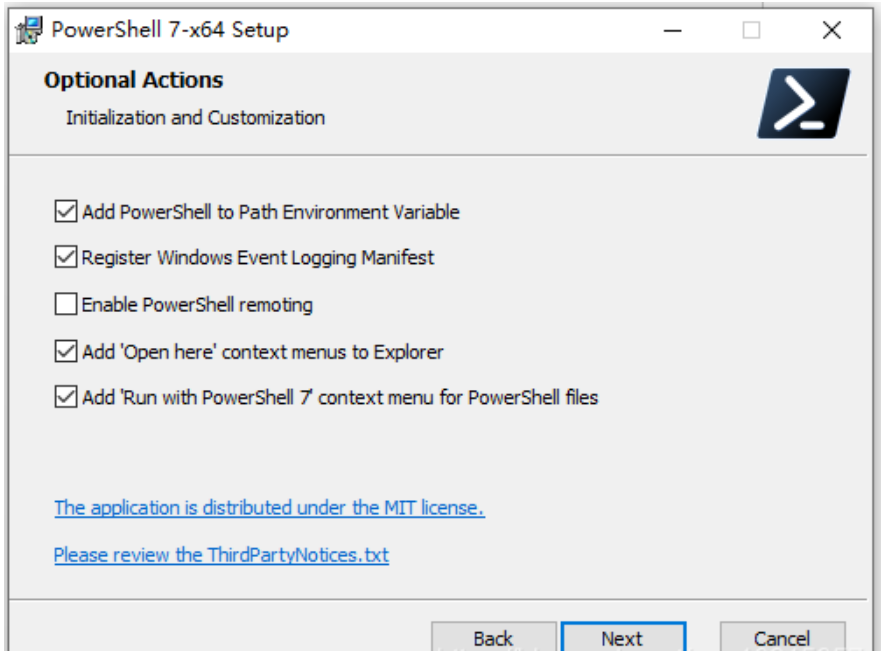
### Windows Terminal 安装
安装很简单，在开始菜单中找到并打开`Microsoft Store`，在搜索框输入`Windows Terminal`然后安装即可。


打开`Windows Terminal`后默认运行内置的`Powershell 5.1`，可以在上方的`下箭头`中找到设置和系统支持的各种命令行工具。

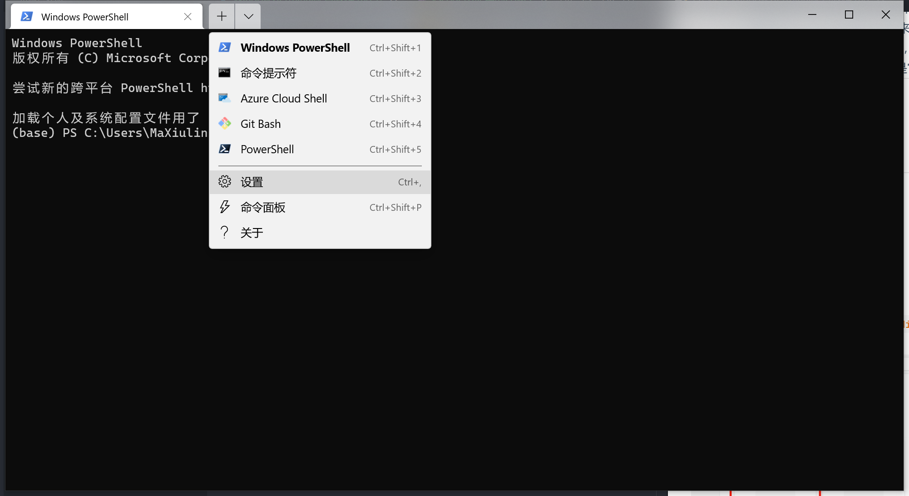

不知道看到这里你能不能理解，本质上`Windows Terminal`就是一个**华丽的外壳**，可以为系统内的各种命令行工具提供一个**一致化的交流界面**，本质上它不提供任何系统交互逻辑。

实际上它主要的为了好看美观而存在的，具体来说的一些优势：
- 支持Unicode和UTF-8字符，比如表情符号
- 使用GPU加速文本呈现
- 支持背景图像，JPG，GIF等均可。

### Windows Terminal配置
先点击`下箭头`，然后在上图的位置中，找到并打开`设置`一项，即可对于`Windows Terminal`的外观进行设置与更改。

配置分为`Windows Terminal`全局的配置文件，；与每一类命令行工具自己的配置，前者决定整个窗体的外观和逻辑的设置，后者决定该工具打开后的一些细节设置。这一点可以从左侧选项卡看出来。
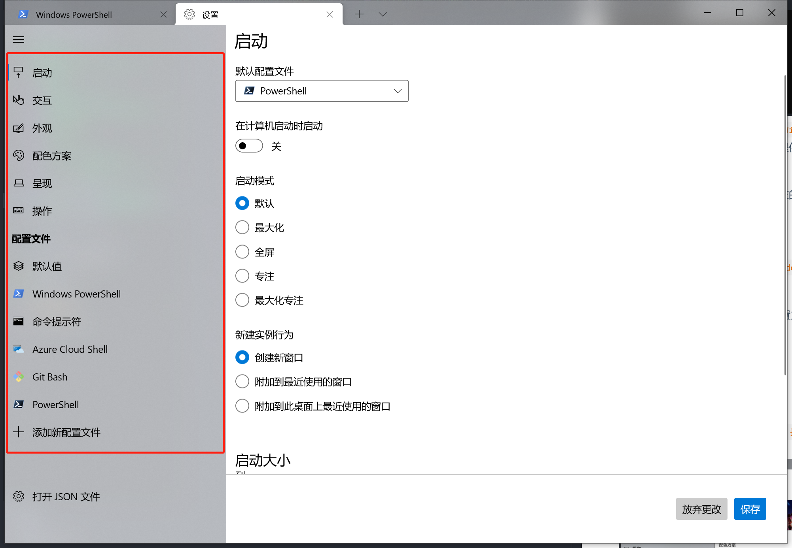

**<font color=blue>首先是一个必须进行的操作，安装后续操作的所需的`Cascadia Code PL`字体:</font>**
前往[Cascadia Code官方发布站](https://github.com/microsoft/cascadia-code/releases)下载最新版字体文件，此处也提供Cascadia Coda字体2111.01版本[直接下载链接](https://github.com/microsoft/cascadia-code/releases/download/v2111.01/CascadiaCode-2111.01.zip)。

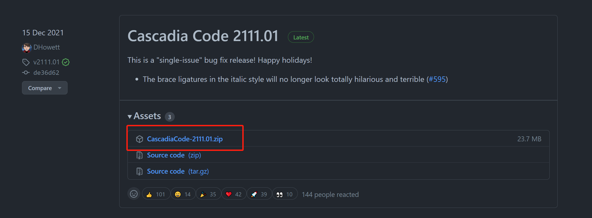

我们使用这个字体的主要原因是其中包含了`Powerline`字形，之后在`Powershell 7`的部分功能中**如果不加载此字体，则会出现乱码。**

这里是[此字体官网](https://docs.microsoft.com/zh-cn/windows/terminal/cascadia-code)提供的部分信息，供你对此字体有简要了解：


连字的具体表现形式，因人而异看喜好：


下载后解压缩，找到文件夹`ttf`下的`CascadiaCodePL.ttf`字体或`CascadiaMonoPL.ttf`字体（看你是否喜欢连字），并**双击该字体文件**进行安装。其他字体如果喜欢，也可以一并安装。此处不做展开。

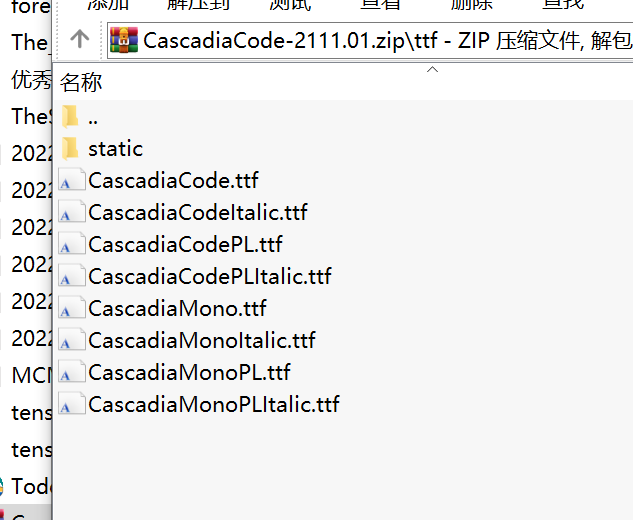

安装好后，重新打开`Windows Terminal`，在设置的左侧找到`Powershell 7`**<font color=red>（在此处为黑色的Powershell，图标蓝色是版本5，黑色是版本7）</font>**

然后在外观子选项卡中，找到字体，并设置为`Cascadia Code PL`或`Cascadia Mono PL`字体即可：

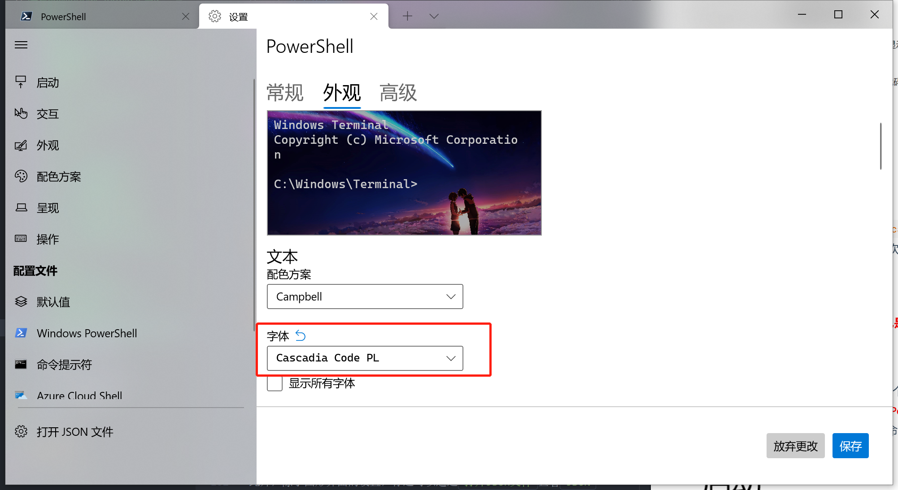

这里**额外推荐**两个值得修改的部分：
- 默认启动，决定了启动时自动展示哪一个命令行工具。修改后单击选项卡栏的`+`号即为默认打开该命令行工具。
  
    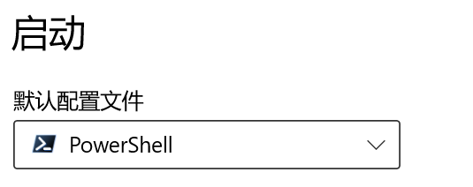

- 在具体的命令行工具设置中，找到【外观】选项，向下找到【背景图像】，修改成自己喜欢的背景即可。
 
    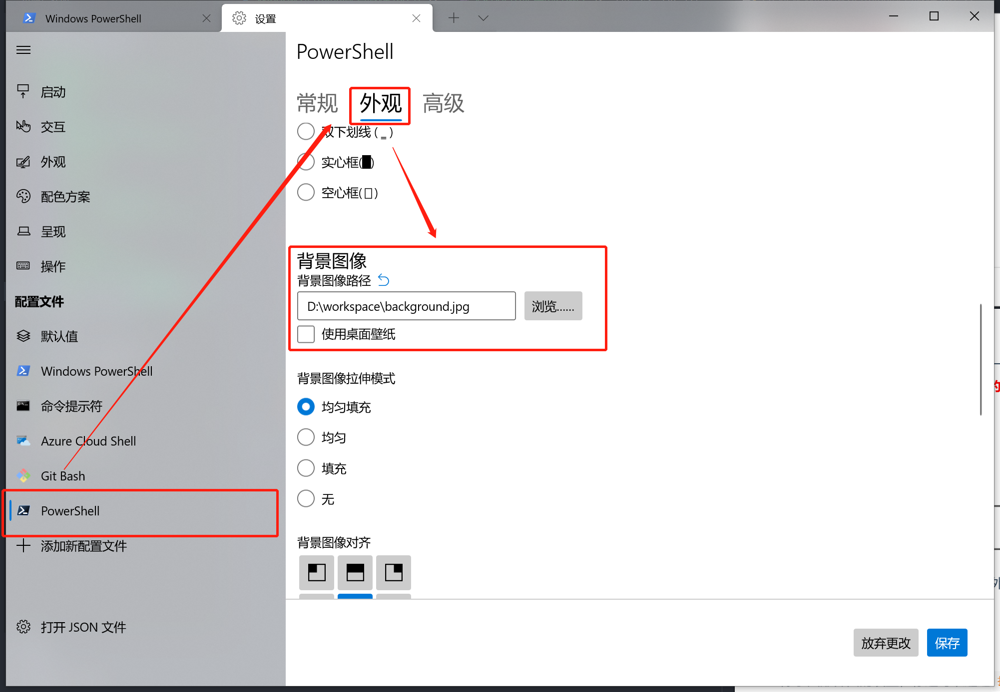

---
#### 进阶
此外，除了图形界面的设置，你还可以通过`打开Json文件`查看`JSON`格式的具体配置文件，可以提供进阶的设置。

如果想深究该文件内的细节以及进阶操作，请前往[Windows Terminal官网](https://docs.microsoft.com/zh-cn/windows/terminal/)查阅官方文档。

  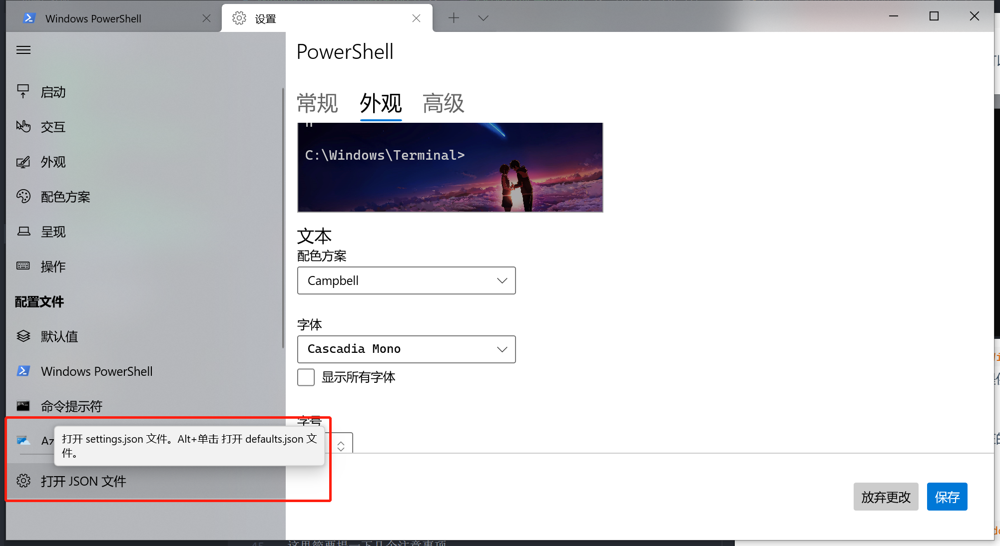


### 配置Powershell 7 （重要！）
使得Powershell变得美观的关键就是安装一系列插件，主要好处在于可以提供对于`Git`仓库的状态概览。以及给你单调的命令行界面提供颜色和风格的美观`PowerLine`。

<font color=red > <b>特别注意！</b></font>既然是提供对于GIT的浏览，该插件是必须**安装GIT**才能不报错，请前往[Git官网](https://git-scm.com/download/win)下载最新版的git以支持本扩展。

使用如下命令在Powershell 7中，在线安装对应插件：
```powershell
# 1. 安装 PSReadline 包，该插件可以让命令行很好用，类似 zsh
Install-Module -Name PSReadLine  -Scope CurrentUser

# 2. 安装 posh-git 包，让你的 git 更好用
Install-Module posh-git  -Scope CurrentUser

# 3. 安装 oh-my-posh 包，让你的命令行更酷炫、优雅
Install-Module oh-my-posh -Scope CurrentUser
```
> 国内此过程可能会比较慢，请耐心等待，科学上网可以加速。

中间会要求你输入确认，输入`Y`或者`A`确认安装即可。

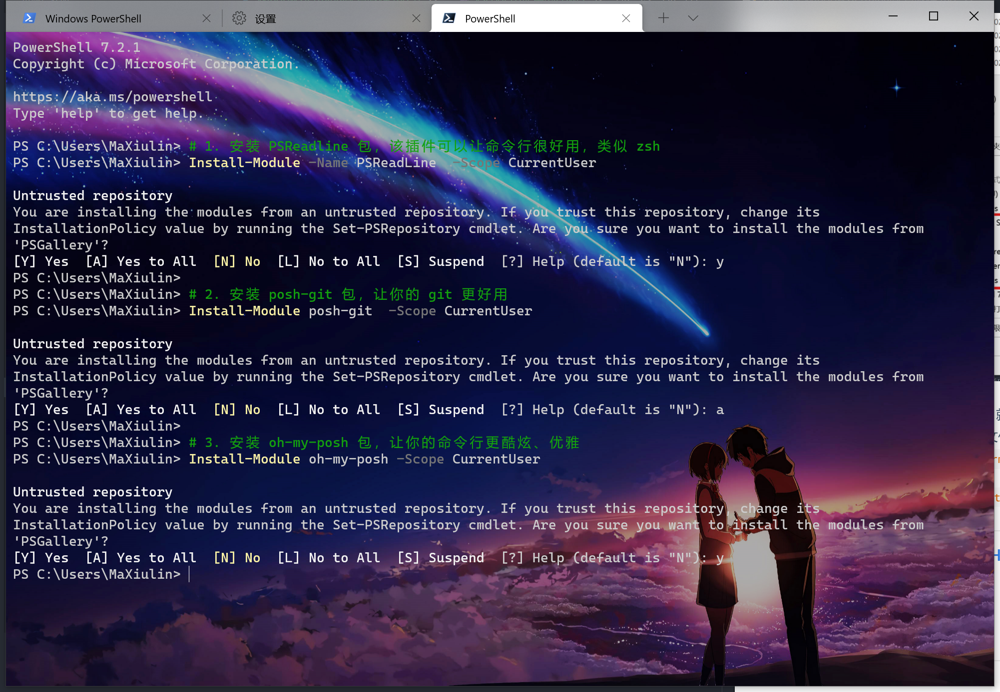

这些包安装好后，还需要使得Powershell可以在每一次运行前加载这些包，以展示炫酷的效果。于是需要编辑一个专用的`ps1`脚本。在这个`ps1`脚本中的代码会**在每一次打开Powershell时先执行一次**。

在`Powershell 7`中，执行下列命令，以使用记事本打开这个特殊脚本的内容，初始为空白：
```
notepad.exe $profile
```
可能会问你没有这个文件，你选择在该处创建，拷入如下代码并保存即可。各个语句的具体功能注释在了语句旁边。
```powershell
# 引入 posh-git
Import-Module posh-git

# 引入 oh-my-posh
Import-Module oh-my-posh

# 引入 ps-read-line
Import-Module PSReadLine

# 设置 PowerShell 主题，v3作者重写过，如果你从网上查可能发现语法不一致
# 这一句决定了你的Powerline的主题，可以寻找其他关键字更改。
Set-PoshPrompt -Theme Paradox 

# 设置Powershell的输入输出编码统一为UTF-8
$OutputEncoding = [console]::InputEncoding = [console]::OutputEncoding = New-Object System.Text.UTF8Encoding
```
><font color=red>`Set-PoshPrompt -Theme Paradox `这句话最后的`Paradox`是一个主题的名字，可以更换为其他的主题，甚至是自定义主题。</font>具体如果想要更换，请参见下文的介绍

此时在`Terminal`中新建一个`Powershell 7`窗口即可预览效果。如果红字报错说系统不允许执行`ps1`脚本，则需要利用**管理员权限**打开一个新的`Windows Terminal`，在其中的`Powershell 7 `输入如下代码赋予权限后，重新打开`Windows Terminal`即可运行。
```powershell
Set-ExecutionPolicy RemoteSigned
```
### 更换主题
- 你可能会觉得目前这个Powershell的主题有点丑，想换一个，作者想必是早有考虑，提供了十几种不同的预设主题，也可以根据特定的语法结构，自行设计主题。
- 提供的主题概览，[前往官网查看全部主题](https://ohmyposh.dev/docs/themes)
  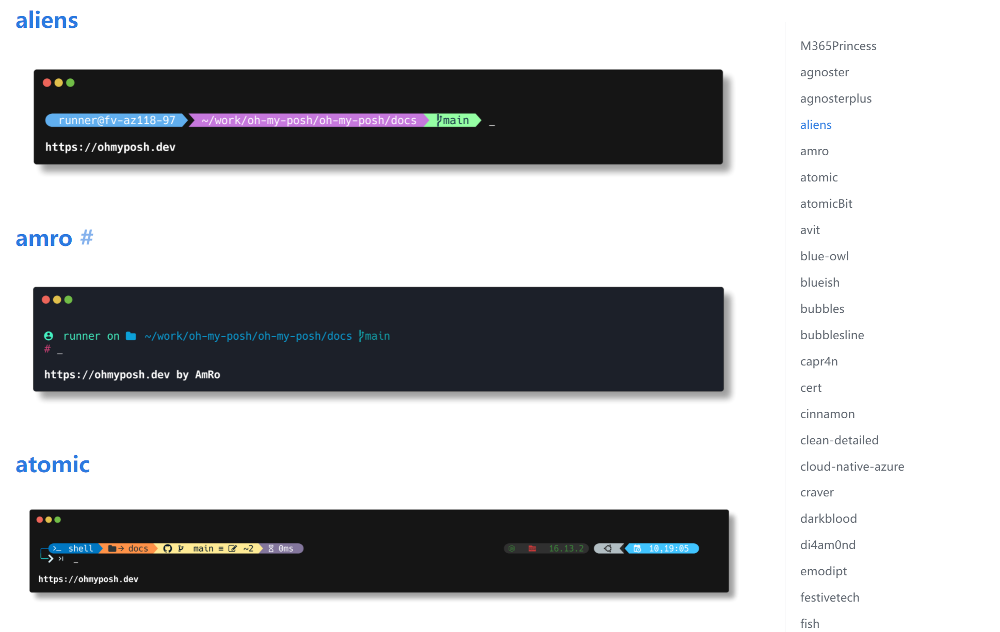  
  - 使用时，只需要将上文的脚本中的`Set-PoshPrompt -Theme Paradox `中的`Paradox`换成你喜欢的主题名字，重新打开Powershell即可，也可以直接在Powershell中输入这行代码动态体验（但是下次打开不会保存）。
  - **如何自定义或修改主题：** 具体来说主题的配置文件储存在一个名为`oh-my-posh`下的`themes`文件夹内。我的两个不同版本的`themes`文件夹放在了不同的地方，一个在`文档\Powershell\Modules\oh-my-posh\3.137.2\themes`下，另一个在`C:\Users\用户名\.oh-my-posh\themes`文件夹下。
    - 如果实在找不到，直接用搜索全盘查一下`oh-my-posh`关键字应该就能找到
    - 笔者建议基于一个已有的主题换颜色即可，具体语法还请在官网自行研究。
- 官方的Github仓库
  [](https://github.com/JanDeDobbeleer/oh-my-posh)

### Powershell 7 适配VS Code
安装好VScode后，使用【Ctrl + Shift + P】打开屏幕上端的命令输入区，在其中输入`>open settings`后找到此选项并点击，会打开一个设置用的JSON文档：

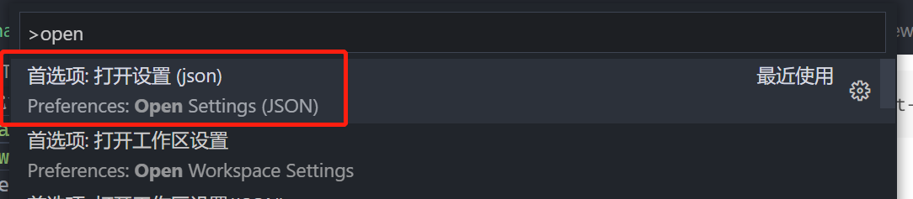

或者在菜单栏找到【文件】→【首选项】→【设置】的右侧界面向下翻，找到`在settings.json中编辑`并单击后，同样能打开该json文档。

这里面存储的是具体的VS Code的设置内容，和图形界面的设置是一一对应的，此处我们要把系统的Powershell适配进去，这样打开VS Code的终端就是我们配置好的Powershell 7。

在此文件 **<font color=red>最外面的大括号中</font>** 拷贝进去如下代码，理论上就可以使你的VS Code兼容目前终端里的所有设置：
```json
    "terminal.integrated.fontSize": 15,
    "terminal.integrated.tabs.enabled": true,
    "terminal.integrated.env.windows": {"LC_ALL":"en_US.UTF-8"},
    "terminal.integrated.profiles.windows": {
      "PowerShell": {
        "source": "PowerShell",
        "icon": "terminal-powershell",
        "args": ["-NoExit",
          "/c",
          "chcp 65001"],
        "font.family" : "Cascadia Code PL"
        }
    },
    "editor.fontFamily": "'Cascadia Code PL', Consolas, 'Courier New', monospace",
```

大致的结果是这样，我这里有很多其他的参数，如果你是初次设置应该信息会非常的少，此处展示只是为了保证你拷贝的时候格式无误：
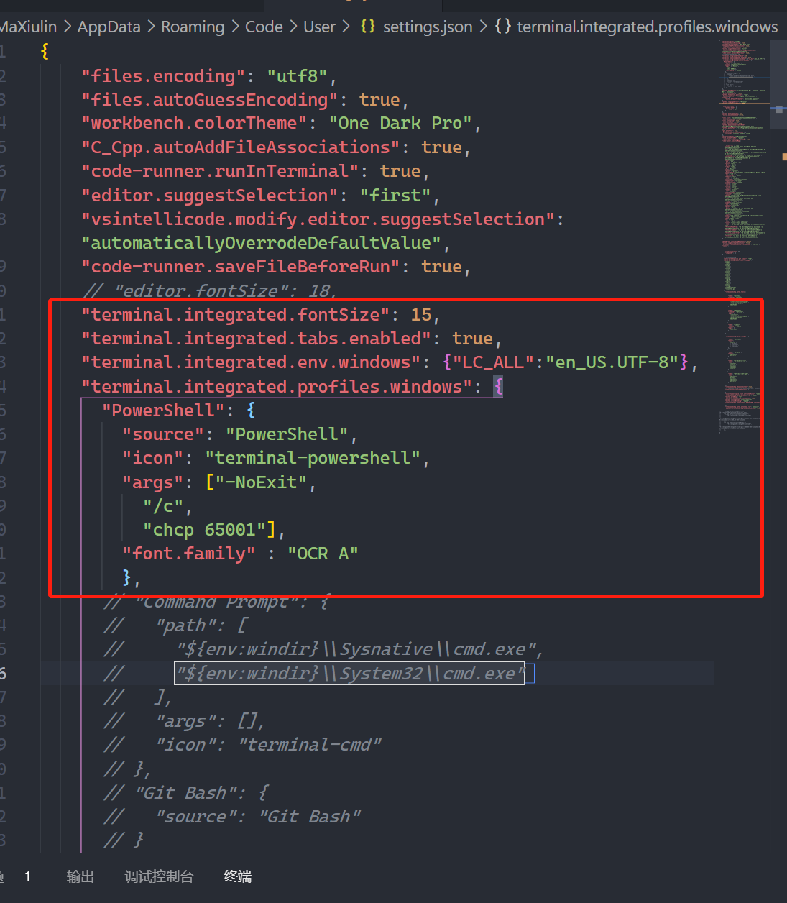

### 添加Windows Terminal到右键菜单 (仅Windows 10)
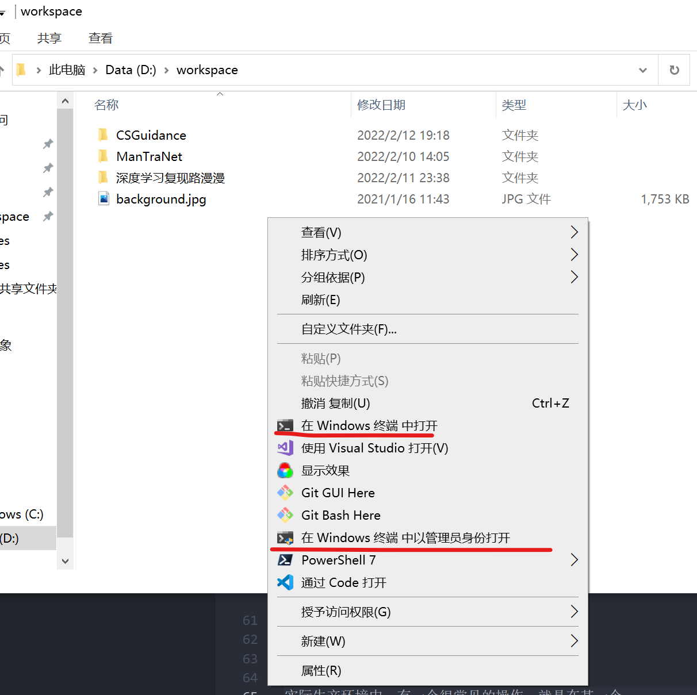

实际生产环境中，有一个很常见的操作，就是在某一个路径下打开命令行工具，进行比如`Git clone`或者编译C++文件等等操作，如果能直接在Windows的右键菜单打开对应路径的`Windows Terminal`，将会节约大量的时间。 

具体的安装方法，提供了Github用户`LittleNewtown`的脚本，请按照该仓库的指引实现这一部分的操作：
[](https://github.com/LittleNewton/Open_Windows_Terminal_Here)


## 参考链接
本文参考了如下博文，如果想深入研究，可以参考：
[什么是Windows终端——微软官网](https://docs.microsoft.com/zh-cn/windows/terminal/)
[Windows Terminal 完美配置 PowerShell 7.1](https://zhuanlan.zhihu.com/p/137595941)
[Set-ExecutionPolicy 设置powershell脚本执行策略 解决ps1脚本禁止运行问题](https://www.jianshu.com/p/9a4722f172a6)